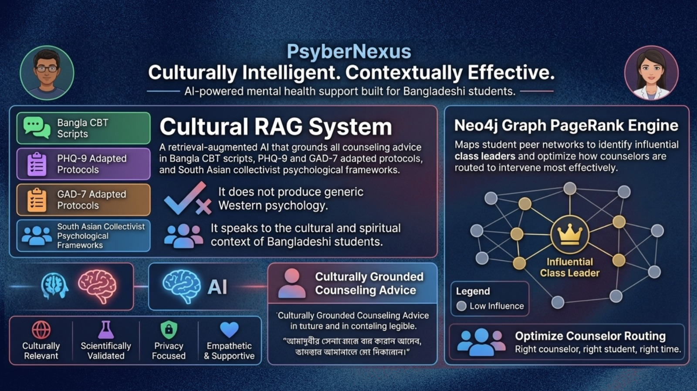
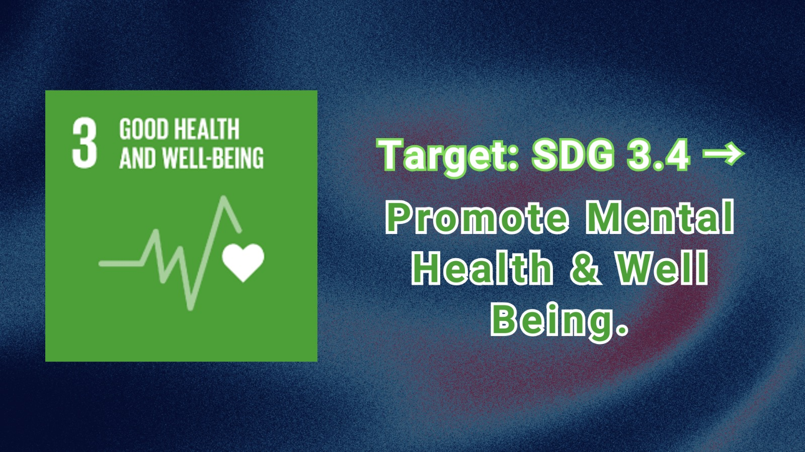
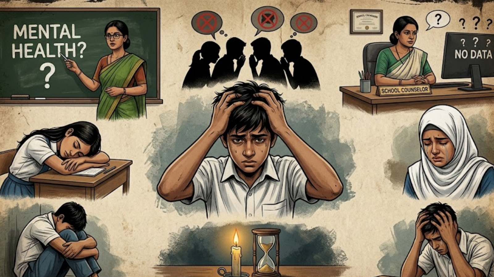
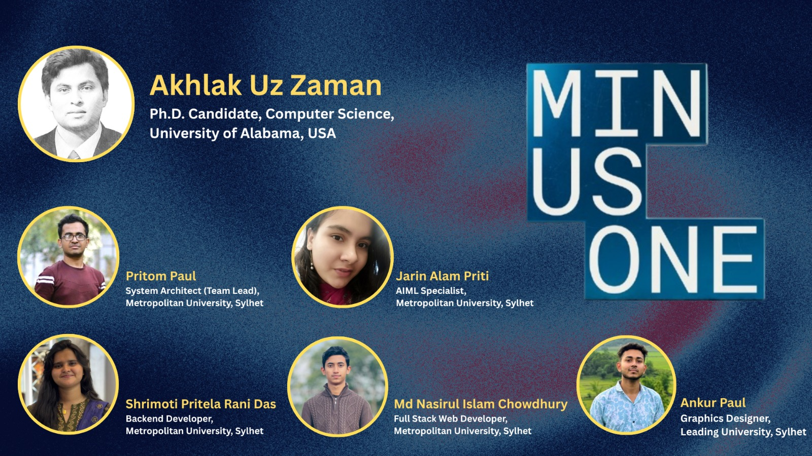

# PsyberNexus — Multimodal Student Mental Health Intelligence Mesh

<p align="center">
  
</p>

> **Multimodal Student Mental Health Intelligence Mesh** — *মাল্টিমোডাল মানসিক স্বাস্থ্য ইন্টেলিজেন্স মেশ*

PsyberNexus is an **AI-native, multimodal mental health intelligence platform** built specifically for student ecosystems in Bangladesh's high-stigma, resource-constrained educational environments. It uses a **7-layer AI stack** to non-intrusively monitor student emotional and psychological states through facial expressions, voice acoustics, text sentiment, and academic engagement — then routes actionable alerts and culturally-adapted interventions to school counselors in real time.

> **বাংলা:** PsyberNexus হলো একটি AI-চালিত মাল্টিমোডাল মানসিক স্বাস্থ্য ইন্টেলিজেন্স প্ল্যাটফর্ম, যা বিশেষভাবে বাংলাদেশের শিক্ষাপ্রতিষ্ঠানের শিক্ষার্থীদের জন্য তৈরি করা হয়েছে। এটি ৭-স্তরের AI প্রযুক্তি ব্যবহার করে শিক্ষার্থীদের মুখভঙ্গি, কণ্ঠস্বর, লেখার অনুভূতি এবং একাডেমিক কার্যক্রমের মাধ্যমে মানসিক অবস্থা পর্যবেক্ষণ করে — এবং কাউন্সেলরদের কাছে রিয়েল-টাইমে সতর্কতা পাঠায়।

🌐 **Live App:** [https://psybernexus-163233355591.asia-southeast1.run.app](https://psybernexus-163233355591.asia-southeast1.run.app)

---

## 📖 Overview

<p align="center">
  
</p>

Mental health in Bangladesh's schools is in crisis, yet it remains almost completely invisible. Students suffer silently, stigma prevents them from speaking up, and counselors — where they even exist — have no tools to identify who needs help before it becomes critical.

**PsyberNexus** is an AI-native, multimodal mental health intelligence mesh built for educational ecosystems in Bangladesh, aligned with **UN Sustainable Development Goal 3.4** and built for the **Healthcare (HealthTech) challenge at AI Infinity BuildFest 2026**. It operates across two interconnected user layers:

- **For counselors** — a real-time clinical intelligence dashboard that passively analyzes four multimodal signals (facial expression via **MTCNN**, voice stress via **Wav2Vec2**, text sentiment via a fine-tuned **Bangla-BERT**, and academic engagement from **LMS** data) and fuses them with a **Multimodal Transformer** into a single, explainable mental health risk score per student.
- **For students** — a private, calming mobile wellness studio in **Bangla & English** for voice-journaling, written reflection, and culturally adapted coping tools (breathing exercises, grounding techniques, Islamic resilience affirmations), plus one-tap access to a counselor or the national emergency helpline **999**.

What makes PsyberNexus unique is its **Cultural RAG** system, which grounds responses in Bangla CBT frameworks, PHQ-9 and GAD-7 adapted protocols, and South Asian collectivist psychological context — so guidance is culturally and spiritually relevant, never generic Western therapy advice. A **Neo4j graph-based PageRank** system maps student peer networks to identify influential individuals and optimize early intervention pathways.

**Privacy is the foundation, not a feature:** raw video and audio never leave the device, only anonymized embeddings are transmitted, the system performs **risk stratification only (no diagnosis)**, and every decision is supervised by a human counselor — a strict human-in-the-loop framework aligned with WHO-style responsible mental health deployment.

PsyberNexus Core is a fully functional **end-to-end MVP** — a 7-layer AI pipeline, React frontend, Supabase edge functions, and Gemini-powered intervention systems. It is not just a prototype; it is a deployable HealthTech system for real-world school environments.

> **Because under SDG 3.4, mental health is not optional — and no student should suffer in silence when the tools to help already exist.**

---

## 🌍 Aligned with UN Sustainable Development Goal 3

<p align="center">
  
</p>

PsyberNexus is built to advance the **United Nations Sustainable Development Goal 3 — Good Health and Well-Being.**

### 🎯 Primary Target: **SDG 3.4 — Promote Mental Health and Well-Being**

> *SDG Target 3.4: "By 2030, reduce by one third premature mortality from non-communicable diseases through prevention and treatment, and **promote mental health and well-being**."*

In Bangladesh, mental health among students is in crisis — yet it remains almost completely invisible. Students suffer silently, stigma prevents them from speaking up, and counselors (where they even exist) have no tools to find who needs help before it is too late.

<p align="center">
  
</p>

PsyberNexus directly addresses **SDG 3.4** by:

| How PsyberNexus Promotes Mental Health & Well-Being |
|---|
| 🧠 **Early Detection** — Passively identifies emotional and psychological distress *before* it escalates into crisis. |
| 🤝 **Access to Support** — Connects at-risk students to counselors and the national helpline (**999** / **109**) in one tap. |
| 🌐 **Reducing Stigma** — Non-intrusive, privacy-first monitoring lets students seek help without fear of judgment. |
| 🕌 **Culturally-Adapted Care** — Grounds all interventions in Bangla CBT, Islamic resilience frameworks, and South Asian collectivist psychology. |
| 📈 **Resource Optimization** — Helps under-resourced schools focus scarce counseling capacity where it is needed most. |

**Because no student should suffer in silence while the tools to help them already exist.**

---

## 🌟 Core Highlights & Architectural Strengths

- **Edge-First Biometric Privacy** — Raw face tracking and audio waveforms are processed locally on-device. ONLY anonymized mathematical embeddings are synced to the campus cloud.
- **Multimodal Fusion (MulT)** — Cross-modal attention networks with Modality Dropout ($p=0.3$), surviving gracefully even if cameras or microphones are disabled.
- **Cultural RAG Integration** — Counseling guidance grounded in adapted Bangla CBT scripts, South Asian collectivist structures, and Islamic mental resilience cards.
- **Graph PageRank Diagnostics** — Maps student peer support meshes using Neo4j + PageRank to find influential class leaders, optimizing counselor routing automatically.
- **Human-In-The-Loop** — The system makes **no diagnoses**. It provides risk stratification and routes every decision to a human counselor.

---

## 🏗️ The 7-Layer AI Architecture

```
Layer 1: INPUT / SENSING      → MTCNN (face), Wav2Vec2 (voice), Bangla-BERT (text), LMS metadata
Layer 2: MULTIMODAL FUSION    → MulT Attention Transformers (T=10 timesteps)
Layer 3: AI INTELLIGENCE      → Cultural PGVector RAG + Neo4j Graph PageRank
Layer 4: MCP ORCHESTRATION    → Screening, Crisis, Intervention, Analytics Agents
Layer 5: BACKEND & STORAGE    → PostgreSQL 15, PGVector Index, Edge SQLite Cache
Layer 6: FRONTEND WORKSPACE   → Counselor Dashboard + Calming Student Mobile PWA
Layer 7: CI/CD DEPLOYMENT     → Cloud Run, Prometheus Model Tracking
```

---

## 🧬 The 4 Sensing Modalities

| Modality | Model | What It Detects |
|---|---|---|
| **1 — Facial Expression (FER)** | MTCNN + DeepFace | 7-class emotion distribution: anger, disgust, fear, happiness, sadness, surprise, neutral + affect timeline |
| **2 — Voice Acoustics** | Wav2Vec2 + Praat | Jitter %, Shimmer dB, HNR, Voice Stress Score, VAD space (Valence/Arousal/Dominance) |
| **3 — Cognitive Text Sentiment** | Bangla-BERT (Distilled) | Negative sentiment score + cognitive distortion detection (catastrophizing, black-and-white thinking, etc.) |
| **4 — Academic LMS Metadata** | Engagement Analyzer | Engagement drop ratio, LMS activity vector, assignment submission patterns |

All four signals are fused by a **Multimodal Transformer (MulT)** into a single, explainable `fused_risk_score`.

---

## 📄 Pages (Routes)

### 1. Landing Page (`/`) — Home
The public-facing marketing and information page introducing PsyberNexus to school administrators, counselors, and policymakers.

**7 Sections:** Hero Section · Trust Strip · Mission + Vision · Capabilities Grid · Two Audiences Section · 7-Layer Architecture Display · CTA Section
*Sub-components: `Eyebrow`, `Stat`, `FloatingBadge`, `PillarCard`, `Capability`, `AudienceCard`, `SiteNav`, `SiteFooter`*

### 2. About Page (`/about`) — About
In-depth documentation covering team background, system milestones, mission/vision pillars, and the full user manual for counselors and students.

**6 Sections:** About Hero · Mission + Vision Pillars (Edge Privacy, Cultural AI, Human-Loop, Ethical Safeguards) · Milestones Timeline (8 milestones, Apr–May 2026) · User Manual Cards · System Behavior Disclaimer ("Not a diagnostic tool") · CTA Section
*Sub-components: `Eyebrow`, `PillarCard`, `ManualCard`, `SiteNav`, `SiteFooter`*

### 3. App Workspace (`/app`) — Main Application
The operational heart of PsyberNexus, with 3 interactive tabs (below).

---

## 🖥️ App Workspace — Tab A: Counselor Core Dashboard

A professional clinical telemetry interface for school counselors to monitor student mental health risk in real time. **(13 components)**

| # | Component | Function |
|---|---|---|
| 1 | **Dynamic Alerts Queue Panel** | Live-updating tray of HIGH/MEDIUM risk alerts with student name, risk score, location, timestamp, and Bangla translation |
| 2 | **Student Risk Queue** | Scrollable list of monitored students with color-coded badges (🔴 HIGH / 🟠 MEDIUM / 🟢 LOW) |
| 3 | **Student Profile Header** | Name, department, year, location, avatar, consent status, "Export PDF" button |
| 4 | **Modality 1 — FER Panel** | Live emotion distribution with horizontal bar charts + affect timeline |
| 5 | **Modality 2 — Voice Acoustics Panel** | Wav2Vec2 metrics: Jitter %, Shimmer dB, HNR, Voice Stress, VAD space |
| 6 | **Modality 3 — Cognitive Text Sentiment** | Bangla-BERT negative sentiment + cognitive distortion list |
| 7 | **Modality 4 — Academic LMS Metadata** | Engagement drop ratio, LMS activity vector, submission patterns |
| 8 | **Weighted Multimodal Fusion Block** | Final `fused_risk_score` via MulT attention + per-modality weights |
| 9 | **Cultural RAG Intervention Panel** | Calls `/api/intervene` → Bangla CBT scripts, Islamic resilience cards, PHQ-9/GAD-7 protocols + safety verification |
| 10 | **Hybridity Indicators Row** | Badges: Bangla CBT ✓, PHQ-9/GAD-7 ✓, Islamic Resilience ✓, Collectivist Frame ✓ |
| 11 | **Geographic Risk Heatmap** | Campus SVG map with color-coded risk nodes (CSE Lab, Academic Building A, Dormitory) |
| 12 | **Manual Alert Emit Button** | Manually trigger an emergency alert via `/api/alert` |
| 13 | **Export PDF Button** | Print-formatted clinical screening report |

---

## 📱 App Workspace — Tab B: Student Calming PWA

A mobile-first Progressive Web App for students — privacy-first design, bilingual Bangla/English toggle, and calming wellness tools. **(7 components)**

| # | Component | Function |
|---|---|---|
| 14 | **Language Toggle** | Switches the entire PWA between বাংলা and English in real-time |
| 15 | **Privacy Alert Banner** | Explains edge-encryption: raw audio/video stays on device; only embeddings sync |
| 16 | **Voice Reflection Journal** | Microphone recording with animated waveform (Wav2Vec2 16kHz) → AI stress analysis |
| 17 | **Student Screening Button** | "Run Screening" triggers `/api/screen` → full multimodal screening with sentiment + distortion results |
| 18 | **Writing Reflection Journal** | Free-form text (Bangla/English) analyzed by Bangla-BERT NLP |
| 19 | **Wellness Swipe Cards** | 3 culturally-adapted coping cards: Breathing Exercise (৪-৭-৮ শ্বাস), Grounding (৫ ইন্দ্রিয়), Dua/Affirmation |
| 20 | **Crisis Trigger Panel** | "Emergency Tip" button (notifies on-duty counselor) + "Helpline 999" direct dial |

---

## 🔬 App Workspace — Tab C: 7-Layer Pipeline Mesh Browser

A technical architecture explorer showing how the entire AI system works end-to-end, with interactive graph calculations. **(4 components)**

| # | Component | Function |
|---|---|---|
| 21 | **Architecture Header** | Title and Dhaka node info description |
| 22 | **Neo4j Graph PageRank Panel** | Fetches live peer-network data via `/api/network/pagerank` → SVG node-graph of student connections + PageRank influence scores for counselor routing |
| 23 | **MulT Fusion Formula Panel** | Mathematical formula of the Multimodal Transformer with per-modality attention weights |
| 24 | **7-Layer Documentation Cards** | Seven expandable cards: INPUT/SENSING, MULTIMODAL FUSION, AI INTELLIGENCE, MCP ORCHESTRATION, BACKEND & STORAGE, FRONTEND WORKSPACE, CI/CD DEPLOYMENT |

---

## 🧩 Shared Components

| Component | File | Function |
|---|---|---|
| **SiteNav** | `SiteNav.tsx` | Top nav: brand logo (Ψ), Home, About, App links, "Edge-Inference Active" status badge |
| **SiteFooter** | `SiteFooter.tsx` | Footer with copyright, ethical disclaimers, site links |
| **Illustrations** | `Illustrations.tsx` | SVG library — 6+ custom vector graphics for landing/about pages |
| **Toast Notification System** | `App.tsx` (inline) | Floating toasts for CRITICAL and INFO alerts — auto-dismiss after 5s |
| **Footer Status Bar** | `App.tsx` (inline) | Status bar showing model version, compliance status, system metrics |

---

## 🔌 Backend API Functions

| Endpoint | File | Function |
|---|---|---|
| `/api/screen` | `functions/screen/index.ts` | Accepts journal text + voice features → runs Bangla-BERT NLP + voice stress analysis → returns full multimodal risk screening |
| `/api/intervene` | `functions/intervene/index.ts` | Takes a student risk profile → queries PGVector Cultural RAG → generates Bangla CBT / PHQ-9 adapted intervention scripts via Gemini AI |
| `/api/alert` | `functions/alert/index.ts` | Emits a structured counselor alert with bilingual details (EN + BN), risk score, campus location, timestamp |
| `/api/network/pagerank` | `server.ts` | Runs Neo4j PageRank on the student peer graph → returns influence scores for counselor routing optimization |

---

## 🤖 ML Pipeline Modules

| Module | File | Model | Function |
|---|---|---|---|
| **FER Pipeline** | `ml/fer/pipeline.py` | MTCNN + DeepFace | Facial expression recognition → 7-class emotion distribution |
| **Voice Pipeline** | `ml/voice/pipeline.py` | Wav2Vec2 + Praat | Voice stress, jitter, shimmer, HNR extraction |
| **Text Pipeline** | `ml/text/pipeline.py` | Bangla-BERT Distilled | Negative sentiment scoring + cognitive distortion detection |
| **MulT Fusion** | `ml/fusion/mult.py` | Multimodal Transformer | Cross-modal attention fusion of all 4 modalities → single `fused_risk_score` |

---

## 📊 Component Count Summary

| Category | Count |
|---|---|
| Pages (Routes) | 3 |
| Landing Page Sections | 7 |
| About Page Sections | 6 |
| App Tab A (Counselor Dashboard) | 13 |
| App Tab B (Student PWA) | 7 |
| App Tab C (Pipeline Browser) | 4 |
| Shared UI Components | 5 |
| Backend API Functions | 4 |
| ML Pipeline Modules | 4 |
| **TOTAL** | **53** |

---

## 🚀 Quickstart & Setup

### 1. Bootstrap the workspace
```bash
chmod +x scripts/setup.sh
./scripts/setup.sh
```

### 2. Configure secrets in `.env`
```env
GEMINI_API_KEY="your_api_key_here"
APP_URL="http://localhost:3000"
```

### 3. Run local development
```bash
# Express full-stack server + Vite SPA preview
npm run dev
```

### 4. Build & start production
```bash
npm run build
npm start
```

### 5. Run end-to-end system tests
```bash
python3 tests/integration/flow_test.py
```

---

## 🛠️ Tech Stack

- **Frontend:** React 19, Vite 6, TailwindCSS 4, Motion, Lucide icons
- **Backend:** Express, TypeScript (tsx / esbuild), Supabase Edge Functions
- **AI / ML:** MTCNN + DeepFace, Wav2Vec2 + Praat, Bangla-BERT, Multimodal Transformer (MulT), Google Gemini (`@google/genai`)
- **Data:** PostgreSQL 15, PGVector, Neo4j (PageRank), Edge SQLite cache
- **Deploy:** Google Cloud Run, Docker Compose, Prometheus model tracking

---

## 🔒 Ethical Safeguards & Consent

1. **No Diagnostic Claims** — The system provides clinical risk stratification, NEVER official psychiatric diagnoses.
2. **Human-In-The-Loop** — Automatically redirects HIGH-risk students to on-duty counselors with one-tap helpline integration (`999` / `109`).
3. **Edge-First Privacy** — Raw video frames and voice recordings **never leave the student's device**. Only anonymized mathematical embeddings are synced.
4. **Consent-Gated Monitoring** — Each student profile carries explicit consent status visible to counselors.

---

## 🎤 The Vision

> *"PsyberNexus is a fully functional end-to-end MVP — covering a 7-layer AI pipeline, a production React frontend, Supabase edge functions, and Gemini-powered intervention generation. It is not just a prototype. It is a deployable system — built for Bangladesh, adaptable globally. Because no student should suffer in silence while the tools to help them already exist."*

---

## 👥 Team Minus One

<p align="center">
  
</p>

<p align="center">
  <strong>We are <em>Team Minus One</em></strong> — a cross-border collective of engineers, researchers, and designers building AI for human well-being.<br/>
  From the classrooms of Sylhet to the labs of Alabama, we came together with one belief:<br/>
  <em>no student should suffer in silence when the tools to help already exist.</em>
</p>

<p align="center">
  🧠 <strong>HealthTech · AI Infinity BuildFest 2026</strong> · 🌍 <strong>UN SDG 3.4</strong>
</p>

| Member | Designation | Institution | LinkedIn |
|---|---|---|---|
| **Akhlak Uz Zaman** | Ph.D. Candidate, Computer Science | University of Alabama, USA | [in/akhlakashik](https://www.linkedin.com/in/akhlakashik/) |
| **Pritom Paul** | System Architect *(Team Lead)* | Metropolitan University, Sylhet | [in/pritompaul24](https://www.linkedin.com/in/pritompaul24/) |
| **Jarin Alam Priti** | AI/ML Specialist | Metropolitan University, Sylhet | [in/jarin-alam](https://www.linkedin.com/in/jarin-alam/) |
| **Shrimoti Pritela Rani Das** | Backend Developer | Metropolitan University, Sylhet | [in/shrimoti-pritela-rani-das](https://www.linkedin.com/in/shrimoti-pritela-rani-das-6791a2378/) |
| **Md Nasirul Islam Chowdhury** | Full Stack Web Developer | Metropolitan University, Sylhet | — |
| **Ankur Paul** | Graphics Designer | Leading University, Sylhet | [in/ankur-paul-23740a410](https://www.linkedin.com/in/ankur-paul-23740a410/) |

---

<p align="center"><em>PsyberNexus — Supporting UN SDG 3.4: Promote Mental Health and Well-Being 🌍</em></p>
<p align="center"><sub>Built with ❤️ by <strong>Team Minus One</strong> · AI Infinity BuildFest 2026</sub></p>
